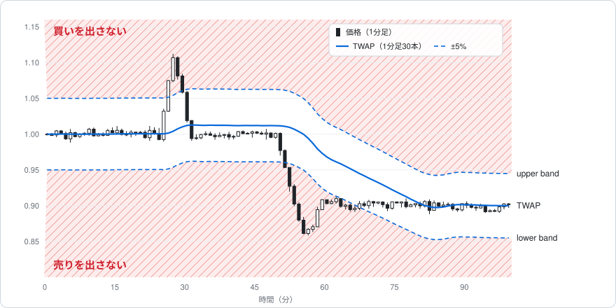
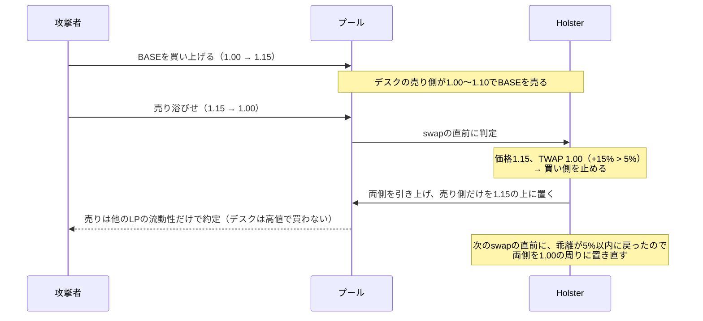
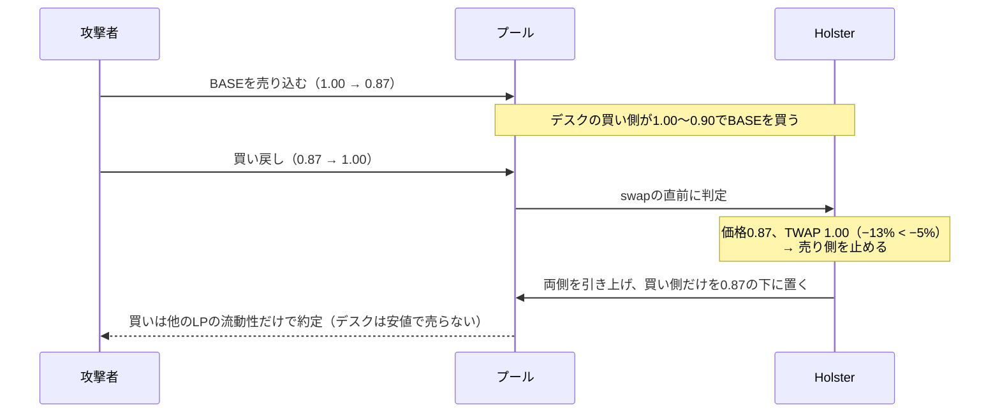

# Holster

[English](README.md) | 日本語

**AMMのLPに「操作された価格では取引しない」ためのバンドをつける。** Uniswap v4のhookと、1inch Aquaの戦略として実装する。

LPの流動性（デスク）を、現在価格の下の買い側と、上の売り側に分けて置く。価格がTWAP（直近の1分足の終値の平均）から大きく離れたら、不利な側だけを引き上げる。状態が変わったら、出してよい側を現在価格の隣に置き直す。判定はすべてオンチェーンで、swapの直前に毎回行う。

## 背景

流動性の供給者は、本来は安く買って高く売ることで利益を出したい。大きく下落したときはしばらく売りを控え、価格が適正な水準、あるいはそれ以上に戻ってから売る。急騰したときは買いを控え、落ち着いてから買う。そうすれば、手数料だけでなく、売買の価格差からも利益を得られる。

ところがAMMのLPは、価格がどう動いても両側に流動性を出し続ける。急落の直後でも安値で売り、急騰の直後でも高値で買ってしまう。流動性の少ないトークンでは、これを狙ったパンプ&ダンプが起きる。

1. 攻撃者が価格を急騰させ、上に置かれた流動性を食う。
2. LP（またはLPを運用するvault）が、範囲を外れたので現在価格の周りに流動性を置き直す。**高値の真下に買い側ができる。**
3. 攻撃者が売り浴びせる。LPは高値で買わされ、価格が戻ったところで損失が確定する。

急落でも同じことが逆向きに起きる（安値の真上に売り側ができ、反発で安く売らされる）。

既存の対策は、手数料を上げる（取引は止まらない）か、プール全体を止める（普通のトレーダーも取引できなくなる）ものが多い。**LPが自分の流動性のうち、不利な側だけを止める仕組み**はない。

## あったほうがいい理由

- 発行体・マーケットメイカー・vaultがLPするとき、普段は流動性を出したまま、価格が異常に動いたときだけ不利な側を止められる。
- 急落の直後に安値で売らず、急騰の直後に高値で買わないので、手数料に加えて売買の価格差からも利益を得やすくなる。
- 判定と実行をすべてオンチェーンで行うので、keeperが落ちても、ガス代が高騰しても、ルールどおりに動く。ルールはコントラクトとして公開され、誰でも検証できる。

## 仕組み

| 要素 | 内容 |
|---|---|
| デスク | 買い側（現在価格から下に幅W%、中身はquote）と売り側（上に幅W%、中身はbase）の2つのポジション |
| TWAP | 直近N本の、確定した1分足の終値の単純平均。本数NはLPが設定できる（例: 30本＝30分）。価格はswapのたびに記録し、取引のない分は直前の価格で埋める。今の足は含めないので、1つのブロックで動かした価格はすぐにはTWAPに入らない |
| band | 価格がTWAPより上に`upper`%以上離れたら**買い側を止める**（高値で買わない）。下に`lower`%以上離れたら**売り側を止める**（安値で売らない）。上下の閾値は別々に設定できる |
| 置き直し | bandの状態が変わったとき（止める・戻す）、または価格が前回の中心から±W%を外れたときだけ、全ポジションを引き上げ、出してよい側を現在価格の隣に置き直す。在庫を半々に戻すswapはしない |
| 実行 | swapの直前に毎回、判定と置き直しを行う（オンチェーンで完結）。誰でも同じ処理を呼べる関数も用意し、オフチェーンのkeeperからも動かせるようにする |

## 挙動

価格がupper bandより上にある間は買いを出さず、lower bandより下にある間は売りを出さない。TWAPは価格に遅れてついてくるので、急な動きはbandの外に出て、落ち着いた動きはbandの中に収まる。

設定の例: 開始価格1.00、デスク10,000 BASE + 10,000 USDC、幅±10%、band ±5%、TWAPは1分足30本。最初は買い側0.90〜1.00、売り側1.00〜1.10。

### 急騰して戻る（パンプ&ダンプ）

デスクは1.00〜1.10で売ったBASEの代金を持ったまま、1.00で買い戻せる位置に戻る。張り直すだけのLPは、1.15の真下に置いた買い側で売り浴びせを受ける。

### 急落して戻る（ダンプ＆反発）

### 動いた価格に落ち着く

価格が1.072に上がってそのまま止まると、買い側は止まったまま。TWAPが少しずつ追いつき、乖離が5%以内になった時点（30分SMAなら約9分後）で、買い側が1.072の下に戻る。新しい価格帯を受け入れて、普段の両側に戻る。

### 置き直しのまとめ

| 状況 | 動き |
|---|---|
| band内で、範囲の中で動く | 何もしない（普通のLPと同じ） |
| 価格がTWAPから上に外れた | 全部引き上げ、売り側だけを現在価格の上に置く |
| 価格がTWAPから下に外れた | 全部引き上げ、買い側だけを現在価格の下に置く |
| bandの中に戻った | 全部引き上げ、両側を現在価格の隣に置く |
| band内のまま、中心から±W%を外れた | 全部引き上げ、両側を現在価格の隣に置く |

## 実装する対象

| | Uniswap v4 | 1inch Aqua |
|---|---|---|
| 流動性 | hookがトークンを預かり、プールにポジションを置く | トークンはLPのウォレットのまま。Aquaの仮想残高で枠を決める |
| 止め方 | 止めた側のポジションをプールから引き上げる | 止めた側の取引を見積もりの段階で断る |
| 置き直し | 流動性を出し入れする | 中心の価格を計算し直すだけ（出し入れなし） |
| 判定のタイミング | swapの直前と、誰でも呼べる`poke()` | 見積もりとswapのたびに毎回（keeper不要） |

TWAP・band・範囲の計算は、両方で同じものを使う。

### パラメータ

| パラメータ | 意味 |
|---|---|
| TWAPの本数 N | TWAPに使う1分足の本数 |
| 幅 W | 片側の幅（価格の±%） |
| 上側の閾値 | 買い側を止める、TWAPからの上方向の乖離 |
| 下側の閾値 | 売り側を止める、TWAPからの下方向の乖離 |
| 出す割合 | 残高のうちプールに出す割合（v4のみ。Aquaは仮想残高で決める） |

## 検証の計画

- **デモ**: 本物のUniswap v4のPoolManagerと、1inchのAqua・SwapVMの上で、パンプ&ダンプを流し、bandあり・なしで損益を比べる。
- **バックテスト**: 実際のswapデータで、普通のLP（全範囲、固定レンジ、範囲を外れたら張り直す）とHolsterを比べる。

## 制約

- 1回の巨大なswapで一気に価格を動かされる場合は防げない（判定はそのswapの直前の価格で行うため）。防げるのは、複数の取引に分かれた値動き。
- swapの直前に置き直すので、そのガス代はswapした人が払う（`poke()`を使えば、keeperが肩代わりできる）。
