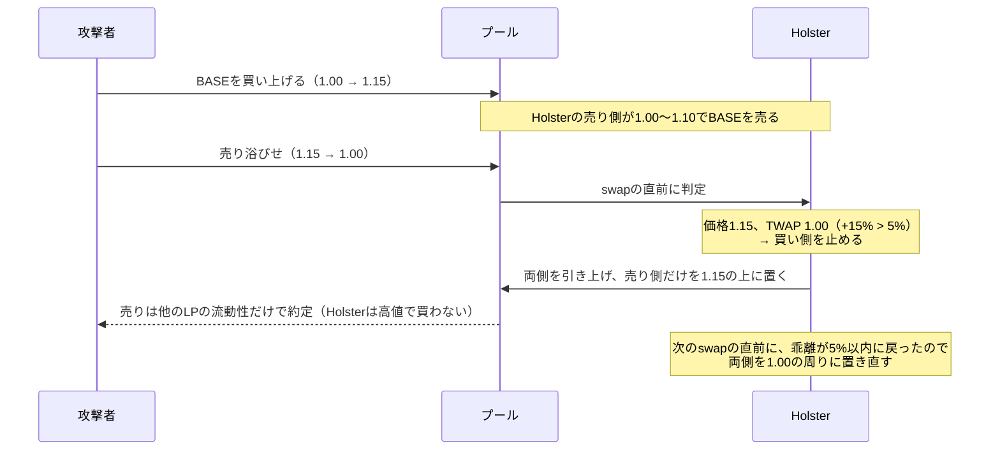
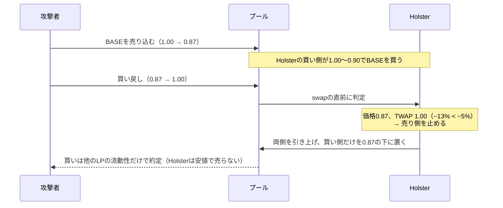

# Holster


[English](README.md) | 日本語

**AMMのLPに「操作された価格では取引しない」ためのバンドをつける。** Uniswap v4のhookと、1inch Aquaの戦略として実装する。

LPの流動性を、現在価格の下の買い側と、上の売り側の2つのポジションに分けて置く。価格がTWAP（直近の1分足の終値の平均）から大きく離れたら、不利な側だけを引き上げる。状態が変わったら、出してよい側を現在価格の隣に置き直す。判定はすべてオンチェーンで、swapの直前に毎回行う。

## 背景

流動性の供給者は、本来は安く買って高く売ることで利益を出したい。大きく下落したときはしばらく売りを控え、価格が適正な水準、あるいはそれ以上に戻ってから売る。急騰したときは買いを控え、落ち着いてから買う。そうすれば、手数料だけでなく、売買の価格差からも利益を得られる。

ところがAMMのLPは、価格がどう動いても両側に流動性を出し続ける。急落の直後でも安値で売り、急騰の直後でも高値で買ってしまう。流動性の少ないトークンでは、これを狙ったパンプ&ダンプが起きる。

1. 攻撃者が価格を急騰させ、上に置かれた流動性を食う。
2. LP（またはLPを運用するvault）が、範囲を外れたので現在価格の周りに流動性を置き直す。**高値の真下に買い側ができる。**
3. 攻撃者が売り浴びせる。LPは高値で買わされ、価格が戻ったところで損失が確定する。

急落でも同じことが逆向きに起きる（安値の真上に売り側ができ、反発で安く売らされる）。

既存の対策は、手数料を上げる（取引は止まらない）か、プール全体を止める（普通のトレーダーも取引できなくなる）ものが多い。**LPが自分の流動性のうち、不利な側だけを止める仕組み**はない。

## あったほうがいい理由

- 発行体・マーケットメイカー・vaultがLPするとき、普段は流動性を出したまま、価格が異常に動いたときだけ不利な側を止められる。
- 急落の直後に安値で売らず、急騰の直後に高値で買わないので、手数料に加えて売買の価格差からも利益を得やすくなる。
- 判定と実行をすべてオンチェーンで行うので、keeperが落ちても、ガス代が高騰しても、ルールどおりに動く。ルールはコントラクトとして公開され、誰でも検証できる。

## 仕組み

| 要素 | 内容 |
|---|---|
| LPポジション | 買い側（現在価格から下に幅W%、中身はquote）と売り側（上に幅W%、中身はbase）の2つのポジション |
| TWAP | 直近N本の、確定した1分足の終値の単純平均。本数NはLPが設定できる（例: 30本＝30分）。価格はswapのたびに記録し、取引のない分は直前の価格で埋める。今の足は含めないので、1つのブロックで動かした価格はすぐにはTWAPに入らない |
| band | 価格がTWAPより上に`upper`%以上離れたら**買い側を止める**（高値で買わない）。下に`lower`%以上離れたら**売り側を止める**（安値で売らない）。上下の閾値は別々に設定できる |
| 置き直し | bandの状態が変わったとき（止める・戻す）、または価格が前回の中心から±W%を外れたときだけ、全ポジションを引き上げ、出してよい側を現在価格の隣に置き直す。在庫を半々に戻すswapはしない |
| 実行 | swapの直前に毎回、判定と置き直しを行う（オンチェーンで完結）。誰でも同じ処理を呼べる関数も用意し、オフチェーンのkeeperからも動かせるようにする |

## 挙動


価格がupper bandより上にある間は買いを出さず、lower bandより下にある間は売りを出さない。TWAPは価格に遅れてついてくるので、急な動きはbandの外に出て、落ち着いた動きはbandの中に収まる。


設定の例: 開始価格1.00、LPの資金10,000 BASE + 10,000 USDC、幅±10%、band ±5%、TWAPは1分足30本。最初は買い側0.90〜1.00、売り側1.00〜1.10。

### 急騰して戻る（パンプ&ダンプ）



Holsterは1.00〜1.10で売ったBASEの代金を持ったまま、1.00で買い戻せる位置に戻る。張り直すだけのLPは、1.15の真下に置いた買い側で売り浴びせを受ける。

### 急落して戻る（ダンプ&反発）



### 動いた価格に落ち着く

価格が1.072に上がってそのまま止まると、買い側は止まったまま。TWAPが少しずつ追いつき、乖離が5%以内になった時点（30分SMAなら約9分後）で、買い側が1.072の下に戻る。新しい価格帯を受け入れて、普段の両側に戻る。

### 置き直しのまとめ

| 状況 | 動き |
|---|---|
| band内で、範囲の中で動く | 何もしない（普通のLPと同じ） |
| 価格がTWAPから上に外れた | 全部引き上げ、売り側だけを現在価格の上に置く |
| 価格がTWAPから下に外れた | 全部引き上げ、買い側だけを現在価格の下に置く |
| bandの中に戻った | 全部引き上げ、両側を現在価格の隣に置く |
| band内のまま、中心から±W%を外れた | 全部引き上げ、両側を現在価格の隣に置く |

### LPポジションの形

**同じ価値で入れなくていい**

v2や、現在価格をまたぐv3のポジションは、baseとquoteを決まった比率で入れる必要がある。Holsterはそうではなく、現在価格をまたがない片側だけのポジションを2つ持つ。

| ポジション | 範囲 | 中身 |
|---|---|---|
| 買い側 | 現在価格より下（例: 0.90〜1.00） | quoteだけ |
| 売り側 | 現在価格より上（例: 1.00〜1.10） | baseだけ |

2つは独立しているので、流動性の量が違ってもよい。在庫がquoteに偏っていれば、買い側が厚く、売り側が薄い形になる。bandで片側を止めるときは、そのポジションを丸ごと引き上げるだけで、もう片方には触れない。

**ポジションは増え続けない**

置き直しのたびに、まず今あるポジションをすべて引き上げ（手数料も回収）、手元の残高で出してよい側を置き直す。そのため、ポジションは常に最大2つ（買い側1つ、売り側1つ）。

| 状況 | ポジション |
|---|---|
| 最初 | 買い側（0.90〜1.00）、売り側（1.00〜1.10） |
| 1.15で上に外れる | 全部引き上げ → 売り側（1.15〜1.27）だけ |
| 1.00に戻る | 全部引き上げ → 買い側（0.90〜1.00）、売り側（1.00〜1.10） |

band内に戻ったときも、残っている売り側に買い側を足すのではなく、両側を置き直す。買い側と売り側は1つには合成されない別々のポジションだが、流動性が同じなら、隣り合った2つは1つのv3ポジションと同じ動きになる。

Aqua版には、そもそもプールに置くポジションがない。中心の価格と2つの範囲の流動性を記録し、置き直しのたびに上書きするだけ。

## 実装

| | Uniswap v4 | 1inch Aqua |
|---|---|---|
| コード | [`contracts/src/HolsterHook.sol`](contracts/src/HolsterHook.sol) | [`contracts/src/HolsterAqua.sol`](contracts/src/HolsterAqua.sol) |
| 流動性 | hookがトークンを預かり、プールにポジションを置く | トークンはLPのウォレットのまま。Aquaの仮想残高で枠を決める |
| 止め方 | 止めた側のポジションをプールから引き上げる | 止めた側の取引を見積もりの段階で断る |
| 置き直し | 流動性を出し入れする | 中心の価格を計算し直すだけ（出し入れなし） |
| 判定のタイミング | swapの直前（`beforeSwap`）と、誰でも呼べる`poke()` | 見積もりとswapのたびに毎回（keeper不要） |
| 組み込み方 | hookのflagは`afterInitialize`・`beforeSwap`・`afterSwap` | 戦略のプログラムは`Extruction`命令1つだけ。公式のAqua・SwapVMルーターをそのまま使う |

TWAP・band・範囲の計算は、両方で同じ[`contracts/src/Band.sol`](contracts/src/Band.sol)を使う。

### パラメータ

| パラメータ | 意味 | デモの値 |
|---|---|---|
| `twapCandles` | TWAPに使う1分足の本数（最大240） | 30 |
| `widthBps` | 片側の幅（価格の±%）。デプロイ後もいつでも変えられる（v4はオーナーが`setWidth`、Aquaは注文のmakerが`setWidth`） | 1000（±10%） |
| `upperBps` | 買い側を止める、TWAPからの上方向の乖離 | 500（5%） |
| `lowerBps` | 売り側を止める、TWAPからの下方向の乖離 | 500（5%） |
| `deployBps` | 出す割合。各側に「資産の半分 × 割合」までを置き、残りは手元に残して、置き直すときに補充する（10000は全部） | 7500（75%） |
| `feeBps` | takerの支払いにかける手数料（Aquaのみ。v4はプールの手数料） | 30（0.3%） |

### オンチェーンとオフチェーン

- **オンチェーン**: v4版はswapの直前に毎回、Aqua版は見積もりとswapのたびに毎回判定するので、keeperがなくてもルールどおりに動く。
- **オフチェーン**: v4版は`needsPoke()`（無料の読み取り）を見て`poke()`を送るkeeper（[`keeper/poke.sh`](keeper/poke.sh)）でも動かせる。置き直しのガス代をswapする人ではなくkeeperが持ち、swapがない間もLPポジションを最新の状態に保てる。

## 検証

### デモ（Foundryのテスト）

本物のUniswap v4のPoolManager、1inchのAquaとSwapVMルーター（v1.0.2、ソースからデプロイ）の上で、パンプ&ダンプを流した。LPの資金は10,000 BASE + 10,000 USDC、幅±10%、band ±5%、出す割合75%（Aquaは100%）。

| シナリオ | band ±5% | bandなし（範囲を外れたら張り直すだけ） |
|---|---:|---:|
| v4: 急騰して戻る（1.00 → 1.15 → 1.00） | **+396 USDC** | −227 USDC |
| v4: 急落して戻る（1.00 → 0.87 → 1.00） | **+431 USDC** | −225 USDC |
| Aqua: 売り側を買い切られた後の売り浴びせ | **+519 USDC**（Holsterが断る） | −154 USDC（そのまま受ける） |

- 1.072に上がって止まると、TWAPが追いつく9分後に買い側が戻る（TWAPを10本にすると3分後）。
- Aqua版は、見積もりと実際のswapの数量が一致する。ルーター以外からの呼び出しは拒否する。

### バックテスト

実際のswapデータで、LPのやり方ごとの損益を比べた。詳細は[docs/backtest.ja.md](docs/backtest.ja.md)。

| ケース | NEAR 30日（急変つきの上昇） | PONS 16日（速く大きく往復） | BaseCat 30日（約6倍の幅を上下） | LIT 30日（上下しながら上昇） |
|---|---:|---:|---:|---:|
| 固定レンジ4段（期間中の値幅を知っている後出し） | +51.6% | **+13.5%** | +67.3% | **+26.9%** |
| 範囲を外れたら張り直すLP | +0.6% | −5.4% | +56.5% | −34.7% |
| **Holster（band ±5%・出す割合75%）** | **+71.0%** | +4.6% | **+75.3%** | +24.5% |

損益は手数料とガス代（そのチェーンの実績の中央値）を含む。Holsterの設定は例で、データに合わせて最適化していない。BaseCatは手数料1%でbotの往復の取引が非常に多く、手数料が極端に大きく出る例。

- Holsterは、4つとも張り直すLPを上回り、4つともプラスだった。
- 急な上げ下げが多い相場（NEAR、BaseCat）では、後出しの固定レンジも上回った。
- 速く往復する相場（PONS）では、後出しの固定レンジに届かない。範囲を外れて置き直すたびに損が確定するためで、bandでは防げないが、残高の一部だけを出すことで小さくできる。

## 利点

- **急な値動きでのインパーマネントロスを抑えられる**: 急騰の頂点や急落の底で不利な側に置き直さないので、在庫の損が小さくなる。バックテストのNEARでは、範囲を外れたら張り直すLPの在庫の値動きが−74.4%だったのに対し、Holsterは+2.3%だった。ただし、往復する相場では在庫の損は残る（PONS 16日で−13.6%）。
- **流動性をどこまで、何本に分けて置くかを決めなくてよい**: 固定レンジを何本か並べる方法は、値動きの幅を前もって当てる必要がある（バックテストで良かった固定レンジ4段は、期間中の値幅を知っている後出しの設定）。Holsterは幅を当てなくても価格についていき、不利な場面だけ止める。

## 今後の課題

- **他のLPがいることが前提になっている**: bandで片側を止めている間の取引は、他のLPの流動性が受ける。バックテストも、他のLPの流動性で価格が動くことを前提にしている。プールの流動性の多くがHolsterになると、止めた側の流動性が薄くなり、価格が大きく動きやすくなるので、効果は変わりうる。
- **出す割合で結果が大きく変わる**: バックテストでは75%がバランスが良かったが、データが少なく、最適化はしていない。トレンドなら多く、往復する相場なら少なく出すほうが良かったので、相場に応じた決め方を検討する必要がある。
- **ガス代が普通のLPより多くかかる**: 置き直すたびに流動性を出し入れするので、置いたままのLPよりガス代がかかる（NEARではEthereumのガス代で−21.3%）。swapの直前に置き直す場合は、そのswapをした人が払う。L2では小さく、Aqua版は置き直しにガス代がかからない。

## 使い方

```bash
git clone --recurse-submodules https://github.com/yuta-mine/holster
cd holster/contracts
forge test -vv          # デモ（パンプ&ダンプ）を含む全テスト
cd .. && python3 backtest/run.py   # バックテスト（標準ライブラリだけで動く）
```

### テストネットへのデプロイ（Base Sepolia）

Uniswap v4は公式のPoolManager（`0x05E73354cFDd6745C338b50BcFDfA3Aa6fA03408`）を使う。1inchは公式のテストネットのデプロイがないため、AquaとSwapVMルーター（v1.0.2）をソースからデプロイする。デモ用のトークンも一緒にデプロイし、LPとして10,000 BASE + 10,000 USDCを入れる。

```bash
cd contracts
cast wallet import deployer --interactive          # 鍵はkeystoreに入れる
export BASE_SEPOLIA_RPC_URL=https://sepolia.base.org

forge script script/DeployV4.s.sol   --rpc-url base_sepolia --account deployer --broadcast
forge script script/DeployAqua.s.sol --rpc-url base_sepolia --account deployer --broadcast

# パンプ&ダンプを流す（v4）
STEP=pump forge script script/DemoV4.s.sol --rpc-url base_sepolia --account deployer --broadcast
STEP=dump forge script script/DemoV4.s.sol --rpc-url base_sepolia --account deployer --broadcast
# Aqua
STEP=pump forge script script/DemoAqua.s.sol --rpc-url base_sepolia --account deployer --broadcast
STEP=dump forge script script/DemoAqua.s.sol --rpc-url base_sepolia --account deployer --broadcast

# 任意: keeper
HOOK=<HolsterHookのアドレス> RPC_URL=$BASE_SEPOLIA_RPC_URL ACCOUNT=deployer ../keeper/poke.sh
```

デプロイしたアドレスは`contracts/deployments/`に書き出される。パラメータは環境変数（`TWAP_CANDLES`、`WIDTH_BPS`、`UPPER_BPS`、`LOWER_BPS`、`DEPLOY_BPS`など）で変えられる。

### フロントエンド（デモ）

[`frontend/`](frontend)は、ビルドの要らない静的なページで、2つの画面がある（英語と日本語を切り替えられる）。

- **仕組み（How it works）**: 課題 → 考え方 → 動き（パンプ&ダンプでの買い側・売り側の動きを図で切り替え）→ 実装 → バックテスト → ライブデモ → 今後の課題、の7ステップのスライド。
- **Base Sepoliaで動かす（Live on Base Sepolia）**: Base Sepoliaにデプロイしたhookの価格・TWAP・band・買い側と売り側の状態・LPの残高を数秒ごとに表示する。パンプ（+15%）とダンプ（−13%）で価格を動かし、hookが不利な側を止める様子を確かめられる（テスト用トークンの受け取りとApproveは自動）。LP（hookをデプロイしたアドレス）で接続すると、流動性の提供・引き出し・幅の変更ができる。

```bash
node frontend/sync-config.mjs      # contracts/deployments/ のアドレスを frontend/config.js に書き込む
python3 -m http.server 8000         # リポジトリのルートで起動し、http://localhost:8000/frontend/ を開く
```

## 制約

- 1回の巨大なswapで一気に価格を動かされる場合は防げない（判定はそのswapの直前の価格で行うため）。防げるのは、複数の取引に分かれた値動き。
- 価格がゆっくり範囲を外れて戻る往復では、bandは発動せず、範囲を外れて置き直すたびに損が確定する。出す割合を下げると小さくできる。
- v4版は、1つのhookにつき1プール・1オーナー。token0をbase、token1をquoteとして扱う。
- v4版は、swapの直前に置き直すので、そのガス代はswapした人が払う（`poke()`を使えば、keeperが肩代わりできる）。
- Aqua版のTWAPは、その戦略自身の約定価格から作る。片側を止めている間、その方向には価格が動かないので、TWAPが追いつくまで止まったままになる。
- Aqua版は、一部だけ約定する（partial fill）ことができない。範囲の端を越える量の取引は断る。

## ライセンス

MIT。以下のライブラリを使っている。

- [Uniswap v4-core](https://github.com/Uniswap/v4-core)、[OpenZeppelin Uniswap Hooks](https://github.com/OpenZeppelin/uniswap-hooks)、[OpenZeppelin Contracts](https://github.com/OpenZeppelin/openzeppelin-contracts)
- [1inch Aqua](https://github.com/1inch/aqua)、[1inch SwapVM](https://github.com/1inch/swap-vm)（Powered by SwapVM — © Degensoft Ltd 2025）
- スワップデータ: [Allium](https://www.allium.so/)
