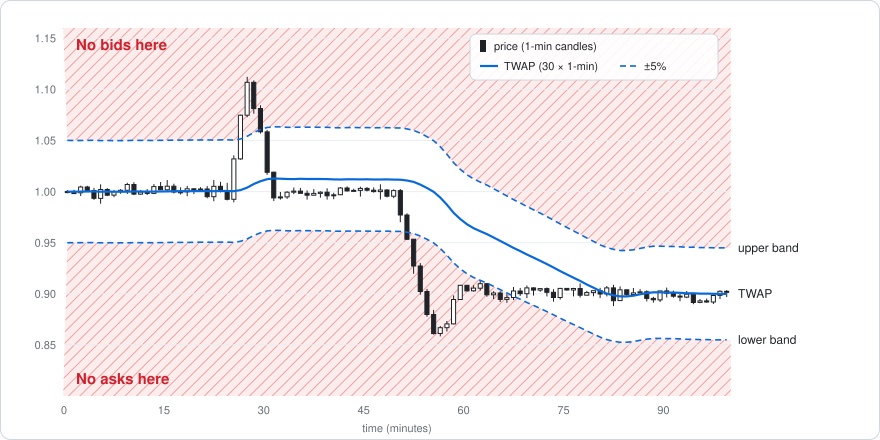
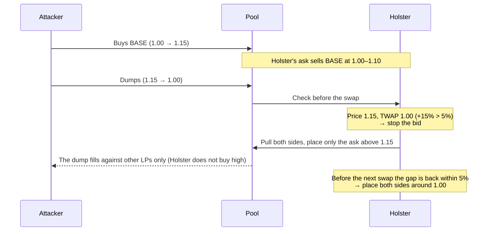
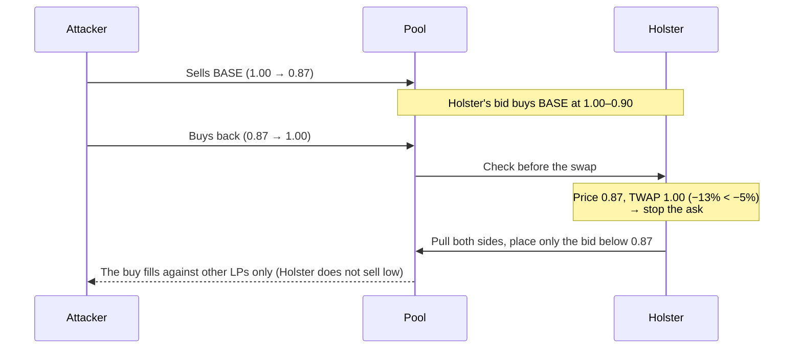

# Holster


English | [日本語](README.ja.md)

**A price band that keeps AMM liquidity from trading at manipulated prices.** Built as a Uniswap v4 hook and as a 1inch Aqua strategy.

The LP's liquidity sits in two positions: a bid below the current price and an ask above it. When the price moves far from its TWAP (the average of recent 1-minute closes), only the side that would lose is pulled. When that state changes, the allowed sides are placed again next to the current price. Every decision is made on-chain, right before each swap.

## Background

A liquidity provider wants to buy low and sell high. After a sharp drop it holds off on selling until the price is back at a fair level or higher; after a sharp jump it holds off on buying until things settle. Done that way, it earns from the price difference on top of the fees.

An AMM LP can't do that. It keeps quoting both sides no matter how the price moves, so it sells low right after a crash and buys high right after a spike. On tokens with little liquidity, pump-and-dumps exploit exactly this:

1. The attacker pumps the price and eats the liquidity above it.
2. The LP (or the vault managing it) sees the price out of range and re-places liquidity around the new price. **A bid now sits right under the top.**
3. The attacker dumps into that bid. The LP buys high, and the loss is locked in once the price falls back.

A dump works the same way in reverse: an ask appears right above the bottom and the LP sells cheap into the rebound.

Existing defenses mostly raise fees (trading continues) or halt the whole pool (ordinary traders are blocked too). **Nothing lets an LP stop only the losing side of its own liquidity.**

## Why it helps

- Issuers, market makers and vaults can keep their liquidity out in normal times and stop only the losing side when the price moves abnormally.
- By not selling low right after a crash and not buying high right after a spike, the LP can earn from the price difference on top of the fees.
- With every check and action on-chain, the rules hold even if a keeper goes down or gas spikes. The rules are public contract code that anyone can verify.

## How it works

| Part | Description |
|---|---|
| LP positions | Two positions: a bid covering W% below the current price (holds quote) and an ask covering W% above it (holds base) |
| TWAP | Simple average of the closes of the last N finished 1-minute candles. The LP sets N (e.g. 30 = 30 minutes). The price is recorded on every swap; minutes with no trades carry the previous close. The candle in progress is excluded, so a price pushed within one block does not enter the TWAP right away |
| Band | Price above TWAP by `upper`% or more: **stop the bid** (don't buy high). Price below TWAP by `lower`% or more: **stop the ask** (don't sell low). The two thresholds are set separately |
| Re-placement | Only when the band state changes (a side stops or returns), or when the price leaves ±W% of the last center: pull every position and place the allowed sides next to the current price. No swap is made to rebalance inventory |
| Execution | The check and the re-placement run right before every swap, fully on-chain. A public function runs the same step, so an off-chain keeper can drive it too |

## Behavior



While the price is above the upper band Holster does not bid, and while it is below the lower band it does not offer. The TWAP trails the price, so sudden moves fall outside the band and orderly moves stay inside it.


Example: start price 1.00, the LP puts in 10,000 BASE + 10,000 USDC, width ±10%, band ±5%, TWAP over 30 one-minute candles. The bid starts at 0.90–1.00 and the ask at 1.00–1.10.

### Pump and dump



Holster keeps the USDC from selling at 1.00–1.10 and is ready to buy back at 1.00. An LP that only re-centers would have put a bid right under 1.15 and absorbed the dump.

### Dump and rebound



### A move that sticks

If the price rises to 1.072 and stays, the bid stays off. The TWAP catches up, and once the gap is within 5% (about 9 minutes for a 30-minute SMA) the bid returns just below 1.072. Holster accepts the new level and goes back to quoting both sides.

### Re-placement at a glance

| Situation | Action |
|---|---|
| Inside the band, inside the range | Nothing (behaves like a normal LP) |
| Price breaks above the TWAP band | Pull everything, place only the ask above the price |
| Price breaks below the TWAP band | Pull everything, place only the bid below the price |
| Price returns inside the band | Pull everything, place both sides next to the price |
| Still inside the band, but ±W% away from the center | Pull everything, place both sides next to the price |

### Shape of the LP positions

**No equal-value deposit needed**

A v2 position, or a v3 position that spans the current price, needs base and quote in a set ratio. Holster instead keeps two one-sided positions that never span the current price.

| Position | Range | Holds |
|---|---|---|
| Bid | Below the current price (e.g. 0.90–1.00) | Quote only |
| Ask | Above the current price (e.g. 1.00–1.10) | Base only |

The two are independent, so their liquidity can differ: with more quote than base, the bid is deep and the ask thin. When the band stops a side, that position is simply pulled whole; the other one is left alone.

**Positions never pile up**

Every re-placement first pulls all existing positions (collecting fees) and then places the allowed sides from the tokens on hand. So there are never more than two positions: one bid and one ask.

| Situation | Positions |
|---|---|
| Start | Bid (0.90–1.00), ask (1.00–1.10) |
| Breaks above the band at 1.15 | Pull everything → ask only (1.15–1.27) |
| Back to 1.00 | Pull everything → bid (0.90–1.00), ask (1.00–1.10) |

Coming back inside the band does not add a bid next to the remaining ask; both sides are placed again. The bid and the ask stay two separate positions and are never merged, but with equal liquidity two adjacent positions behave exactly like one v3 position.

The Aqua version has no positions in a pool at all. It records a center price and the liquidity of its two ranges, and overwrites them on every re-placement.

## Implementation

| | Uniswap v4 | 1inch Aqua |
|---|---|---|
| Code | [`contracts/src/HolsterHook.sol`](contracts/src/HolsterHook.sol) | [`contracts/src/HolsterAqua.sol`](contracts/src/HolsterAqua.sol) |
| Liquidity | The hook holds the tokens and keeps positions in the pool | Tokens stay in the LP's wallet; Aqua's virtual balances set the budget |
| Stopping a side | Pull that side's position from the pool | Reject that side's trades at quote time |
| Re-placement | Remove and add liquidity | Recompute the center price only (nothing moves) |
| When it checks | Before each swap (`beforeSwap`) and via a public `poke()` | On every quote and swap (no keeper needed) |
| How it plugs in | Hook flags: `afterInitialize`, `beforeSwap`, `afterSwap` | The strategy program is a single `Extruction` instruction on the official Aqua and SwapVM router |

Both use the same TWAP, band and range math in [`contracts/src/Band.sol`](contracts/src/Band.sol).

### Parameters

| Parameter | Meaning | Demo value |
|---|---|---|
| `twapCandles` | Number of 1-minute candles in the TWAP (up to 240) | 30 |
| `widthBps` | Width of each side (± % of price). Can be changed at any time after deployment (v4: the owner calls `setWidth`; Aqua: the order's maker calls `setWidth`) | 1000 (±10%) |
| `upperBps` | Upward gap from the TWAP that stops the bid | 500 (5%) |
| `lowerBps` | Downward gap from the TWAP that stops the ask | 500 (5%) |
| `deployBps` | Deployed share: each side gets at most "half of the value × share"; the rest is kept in reserve and tops the side up at the next re-placement (10000 = every token) | 7500 (75%) |
| `feeBps` | Fee on the taker's input (Aqua only; v4 uses the pool fee) | 30 (0.3%) |

### On-chain and off-chain

- **On-chain**: the v4 hook checks before every swap and the Aqua strategy on every quote and swap, so the rules hold with no keeper at all.
- **Off-chain**: the v4 hook can also be driven by a keeper that reads `needsPoke()` for free and sends `poke()` ([`keeper/poke.sh`](keeper/poke.sh)). The keeper then pays the re-placement gas instead of the next swapper and keeps the positions current between swaps.

## Validation

### Demo (Foundry tests)

A pump-and-dump run on the real Uniswap v4 PoolManager and on 1inch Aqua with the SwapVM router (v1.0.2, deployed from source). LP funds: 10,000 BASE + 10,000 USDC, width ±10%, band ±5%, 75% deployed (100% on Aqua).

| Scenario | Band ±5% | No band (re-center when out of range) |
|---|---:|---:|
| v4: pump and back (1.00 → 1.15 → 1.00) | **+396 USDC** | −227 USDC |
| v4: dump and back (1.00 → 0.87 → 1.00) | **+431 USDC** | −225 USDC |
| Aqua: dump after the whole ask was bought | **+519 USDC** (Holster refuses) | −154 USDC (absorbed) |

- After a jump to 1.072 that sticks, the bid returns once the TWAP catches up: 9 minutes later (3 minutes with a 10-candle TWAP).
- On Aqua, quotes and the swaps that follow return the same amounts, and only the router can call the strategy.

### Backtest

Real swap data replayed to compare ways of providing liquidity. Details: [docs/backtest.md](docs/backtest.md).

| Case | NEAR 30 days (trend with sharp moves) | PONS 16 days (fast, wide ranging) | BaseCat 30 days (swings over a 6× range) | LIT 30 days (choppy uptrend) |
|---|---:|---:|---:|---:|
| Fixed, 4 ranges (hindsight: knows the period's range) | +51.6% | **+13.5%** | +67.3% | **+26.9%** |
| Re-centering LP | +0.6% | −5.4% | +56.5% | −34.7% |
| **Holster (band ±5%, 75% deployed)** | **+71.0%** | +4.6% | **+75.3%** | +24.5% |

P&L includes fees and gas (median measured on each chain). The Holster setting is an example and was not optimized on the data. BaseCat is a 1% pool with very heavy bot round-trip volume, so its fees are extreme.

- Holster beat the re-centering LP on all four and was positive on all four.
- In markets with many sharp moves (NEAR, BaseCat) it also beat the hindsight fixed ranges.
- In a fast-ranging market (PONS) it falls short of the hindsight fixed ranges: every re-placement after leaving the range locks in a loss. The band cannot stop that, but deploying only part of the balance shrinks it.

## Benefits

- **Less impermanent loss on sudden moves**: Holster does not re-place the losing side at the top of a spike or the bottom of a crash, so its inventory loses less. In the NEAR backtest, a re-centering LP lost 74.4% on inventory while Holster made +2.3%. It does not remove the loss in ranging markets (−13.6% on PONS 16 days).
- **No need to decide how far, or in how many ranges, to place liquidity**: a set of fixed ranges only works if you call the price range in advance (the fixed 4 ranges that did well in the backtest were placed with hindsight). Holster follows the price without knowing the range and only stops at the bad moments.

## Open questions

- **It relies on other LPs being there**: while the band stops a side, trades on that side are filled by other LPs, and the backtest assumes other liquidity moves the price. If most of a pool used Holster, the stopped side would be thin and the price would move more, which could change the results.
- **Results depend a lot on the deployed share**: 75% balanced well in the backtest, but the data is small and nothing was optimized. More was better in the trend and less in the ranging market, so the share should be chosen with the market in mind.
- **More gas than a plain LP**: every re-placement removes and adds liquidity (−21.3% of capital on NEAR with Ethereum gas). When it happens right before a swap, that swapper pays. It is small on L2, and the Aqua version needs no gas to re-place.

## Usage

```bash
git clone --recurse-submodules https://github.com/yuta-mine/holster
cd holster/contracts
forge test -vv          # all tests, including the pump-and-dump demos
cd .. && python3 backtest/run.py   # backtest (standard library only)
```

### Deploy to a testnet (Base Sepolia)

Uniswap v4 uses the official PoolManager (`0x05E73354cFDd6745C338b50BcFDfA3Aa6fA03408`). 1inch has no official testnet deployment, so Aqua and the SwapVM router (v1.0.2) are deployed from source. Demo tokens are deployed too, and the LP puts in 10,000 BASE + 10,000 USDC.

```bash
cd contracts
cast wallet import deployer --interactive          # keep the key in a keystore
export BASE_SEPOLIA_RPC_URL=https://sepolia.base.org

forge script script/DeployV4.s.sol   --rpc-url base_sepolia --account deployer --broadcast
forge script script/DeployAqua.s.sol --rpc-url base_sepolia --account deployer --broadcast

# pump and dump (v4; the band-off pool gets the same moves)
STEP=pump forge script script/DemoV4.s.sol --rpc-url base_sepolia --account deployer --broadcast
STEP=dump forge script script/DemoV4.s.sol --rpc-url base_sepolia --account deployer --broadcast
# start over with the same tokens: back to 1.00 with 10,000 BASE + 10,000 USDC (wait 30 min for the TWAP)
STEP=reset forge script script/DemoV4.s.sol --rpc-url base_sepolia --account deployer --broadcast
# or start over from scratch: new tokens and pools, and the frontend config updated (run at the repo root)
../init-demo.sh
# Aqua
STEP=pump forge script script/DemoAqua.s.sol --rpc-url base_sepolia --account deployer --broadcast
STEP=dump forge script script/DemoAqua.s.sol --rpc-url base_sepolia --account deployer --broadcast

# optional: keeper (watches the latest demo pools in deployments/; HOOKS="0x.. 0x.." to pick hooks)
INTERVAL=5 RPC_URL=$BASE_SEPOLIA_RPC_URL ACCOUNT=deployer ../keeper/poke.sh
```

Deployed addresses are written to `contracts/deployments/`. Parameters can be changed with environment variables (`TWAP_CANDLES`, `WIDTH_BPS`, `UPPER_BPS`, `LOWER_BPS`, `DEPLOY_BPS`, ...).

### Frontend (demo)

[`frontend/`](frontend) is a static page with no build step and two views (English or Japanese).

- **How it works**: seven slides: the problem → the idea → how it reacts (a pump and dump stepped through on a price axis) → how it's built → backtest → live demo → open questions.
- **Live on Base Sepolia**: the hook deployed on Base Sepolia, live: price, TWAP, band, the state of the bid and ask, and the LP's holdings. When the band-off pool is deployed, both LPs' P&L against just holding the deposit is shown side by side. Pump (+15%) or dump (−13%) the pool and watch the hook pull the losing side (test tokens and approvals are handled for you). Connected as the LP (the address that deployed the hook), you can also provide liquidity, withdraw and change the width.

```bash
node frontend/sync-config.mjs      # copies addresses from contracts/deployments/ into frontend/config.js
python3 -m http.server 8000         # run at the repo root, then open http://localhost:8000/frontend/
```

## Limits

- A single huge swap that moves the price all at once cannot be stopped (the check uses the price right before that swap). What it stops are moves spread over several trades.
- When the price drifts slowly out of the range and back, the band does not trigger, and every re-placement after leaving the range locks in a loss. A lower deployed share shrinks it.
- The v4 hook serves one pool and one owner, and treats token0 as base and token1 as quote.
- On v4, re-placement right before a swap is paid for by that swapper (a keeper can take this over with `poke()`).
- On Aqua, the TWAP is built from the strategy's own trade prices. While one side is stopped the price cannot move that way, so the side stays off until the TWAP catches up.
- On Aqua, partial fills are not possible; a trade larger than what is left in the range is refused.

## License

MIT. Built with:

- [Uniswap v4-core](https://github.com/Uniswap/v4-core), [OpenZeppelin Uniswap Hooks](https://github.com/OpenZeppelin/uniswap-hooks), [OpenZeppelin Contracts](https://github.com/OpenZeppelin/openzeppelin-contracts)
- [1inch Aqua](https://github.com/1inch/aqua), [1inch SwapVM](https://github.com/1inch/swap-vm) (Powered by SwapVM — © Degensoft Ltd 2025)
- Swap data: [Allium](https://www.allium.so/)
