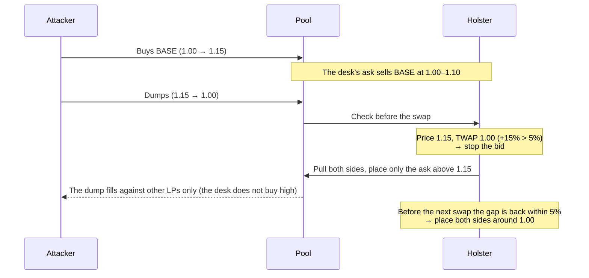
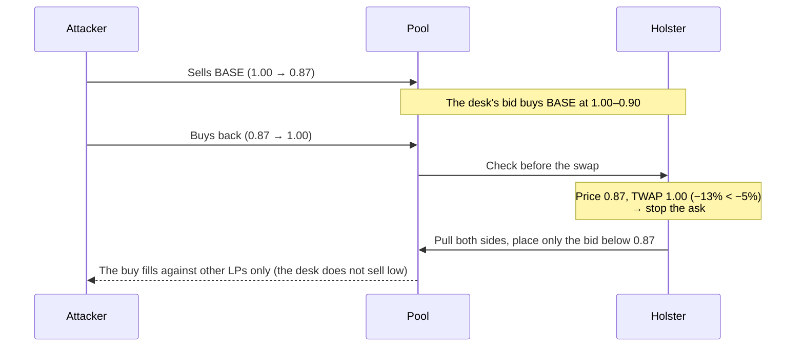

# Holster

English | [日本語](README.ja.md)

**A price band that keeps AMM liquidity from trading at manipulated prices.** Built as a Uniswap v4 hook and as a 1inch Aqua strategy.

The LP's liquidity (the desk) sits in two parts: a bid below the current price and an ask above it. When the price moves far from its TWAP (the average of recent 1-minute closes), only the side that would lose is pulled. When that state changes, the allowed sides are placed again next to the current price. Every decision is made on-chain, right before each swap.

## Background

A liquidity provider wants to buy low and sell high. After a sharp drop it holds off on selling until the price is back at a fair level or higher; after a sharp jump it holds off on buying until things settle. Done that way, it earns from the price difference on top of the fees.

An AMM LP can't do that. It keeps quoting both sides no matter how the price moves, so it sells low right after a crash and buys high right after a spike. On tokens with little liquidity, pump-and-dumps exploit exactly this:

1. The attacker pumps the price and eats the liquidity above it.
2. The LP (or the vault managing it) sees the price out of range and re-places liquidity around the new price. **A bid now sits right under the top.**
3. The attacker dumps into that bid. The LP buys high, and the loss is locked in once the price falls back.

A dump works the same way in reverse: an ask appears right above the bottom and the LP sells cheap into the rebound.

Existing defenses mostly raise fees (trading continues) or halt the whole pool (ordinary traders are blocked too). **Nothing lets an LP stop only the losing side of its own liquidity.**

## Why it helps

- Issuers, market makers and vaults can keep their liquidity out in normal times and stop only the losing side when the price moves abnormally.
- By not selling low right after a crash and not buying high right after a spike, the LP can earn from the price difference on top of the fees.
- With every check and action on-chain, the rules hold even if a keeper goes down or gas spikes. The rules are public contract code that anyone can verify.

## How it works

| Part | Description |
|---|---|
| Desk | Two positions: a bid covering W% below the current price (holds quote) and an ask covering W% above it (holds base) |
| TWAP | Simple average of the closes of the last N finished 1-minute candles. The LP sets N (e.g. 30 = 30 minutes). The price is recorded on every swap; minutes with no trades carry the previous close. The candle in progress is excluded, so a price pushed within one block does not enter the TWAP right away |
| Band | Price above TWAP by `upper`% or more: **stop the bid** (don't buy high). Price below TWAP by `lower`% or more: **stop the ask** (don't sell low). The two thresholds are set separately |
| Re-placement | Only when the band state changes (a side stops or returns), or when the price leaves ±W% of the last center: pull every position and place the allowed sides next to the current price. No swap is made to rebalance inventory |
| Execution | The check and the re-placement run right before every swap, fully on-chain. A public function runs the same step, so an off-chain keeper can drive it too |

## Behavior

While the price is above the upper band the desk does not bid, and while it is below the lower band the desk does not offer. The TWAP trails the price, so sudden moves fall outside the band and orderly moves stay inside it.

Example: start price 1.00, desk of 10,000 BASE + 10,000 USDC, width ±10%, band ±5%, TWAP over 30 one-minute candles. The bid starts at 0.90–1.00 and the ask at 1.00–1.10.

### Pump and dump

The desk keeps the USDC from selling at 1.00–1.10 and is ready to buy back at 1.00. An LP that only re-centers would have put a bid right under 1.15 and absorbed the dump.

### Dump and rebound

### A move that sticks

If the price rises to 1.072 and stays, the bid stays off. The TWAP catches up, and once the gap is within 5% (about 9 minutes for a 30-minute SMA) the bid returns just below 1.072. The desk accepts the new level and goes back to quoting both sides.

### Re-placement at a glance

| Situation | Action |
|---|---|
| Inside the band, inside the range | Nothing (behaves like a normal LP) |
| Price breaks above the TWAP band | Pull everything, place only the ask above the price |
| Price breaks below the TWAP band | Pull everything, place only the bid below the price |
| Price returns inside the band | Pull everything, place both sides next to the price |
| Still inside the band, but ±W% away from the center | Pull everything, place both sides next to the price |

## What gets built

| | Uniswap v4 | 1inch Aqua |
|---|---|---|
| Liquidity | The hook holds the tokens and keeps positions in the pool | Tokens stay in the LP's wallet; Aqua's virtual balances set the budget |
| Stopping a side | Pull that side's position from the pool | Reject that side's trades at quote time |
| Re-placement | Remove and add liquidity | Recompute the center price only (nothing moves) |
| When it checks | Before each swap, and via a public `poke()` | On every quote and swap (no keeper needed) |

Both use the same TWAP, band and range math.

### Parameters

| Parameter | Meaning |
|---|---|
| TWAP length N | Number of 1-minute candles in the TWAP |
| Width W | Width of each side (± % of price) |
| Upper threshold | Upward gap from the TWAP that stops the bid |
| Lower threshold | Downward gap from the TWAP that stops the ask |
| Deploy share | Share of the balance placed in the pool (v4 only; Aqua uses virtual balances) |

## Validation plan

- **Demo**: run a pump-and-dump on the real Uniswap v4 PoolManager and on 1inch Aqua and SwapVM, and compare the P&L with and without the band.
- **Backtest**: replay real swap data and compare normal LPs (full range, fixed range, re-center when out of range) with Holster.

## Limits

- A single huge swap that moves the price all at once cannot be stopped (the check uses the price right before that swap). What it stops are moves spread over several trades.
- Re-placement right before a swap is paid for by that swapper (a keeper can take this over with `poke()`).
