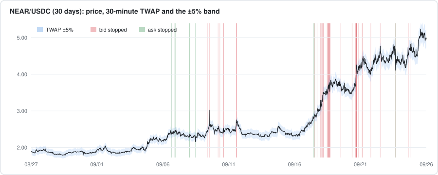
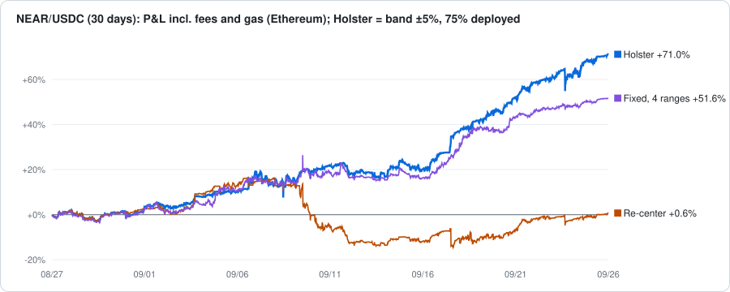
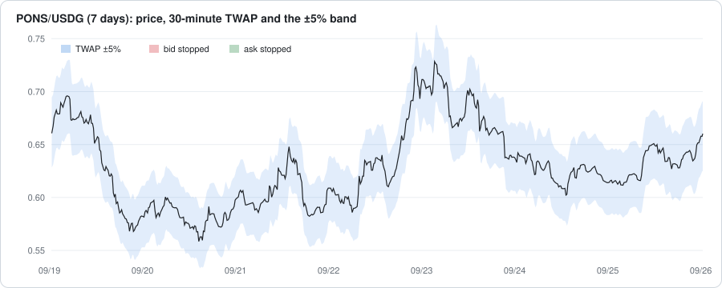
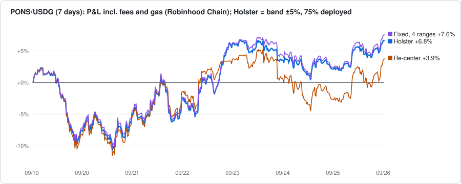
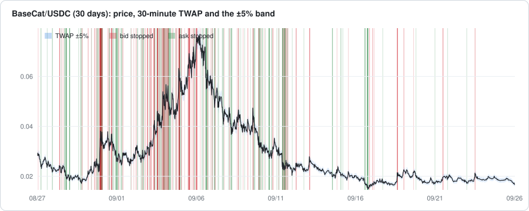
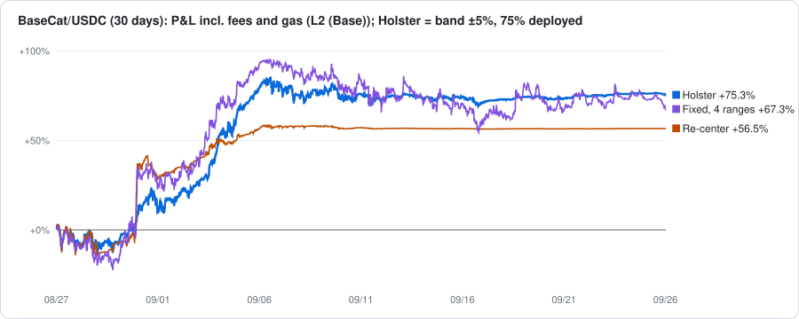
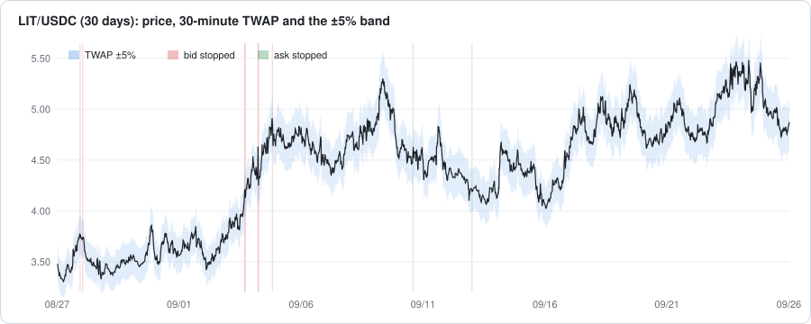
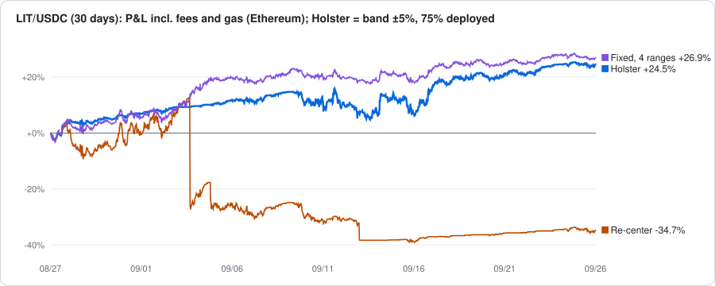

# Backtest

English | [日本語](backtest.ja.md)

Real swap data, replayed to compare ways of providing liquidity. Code is in [`backtest/`](../backtest); every case is in [`backtest/results/results.md`](../backtest/results/results.md).

```bash
python3 backtest/run.py   # standard library only; rebuilds the tables and charts
```

## Data sets

| Data set | Pool | Chain | Period (UTC) | Swaps | Fee | Starting capital |
|---|---|---|---|---:|---|---:|
| NEAR 30 days | NEAR/USDC (Uniswap v3, `0xee8aaa362a75fbf8e0a38a50ddc27f38551e16ea`) | Ethereum | 2026-08-27 to 09-26 | 18,823 | 0.3% | $1,000 |
| PONS 16 days | PONS/USDG (Uniswap v4, pool id `0x486435a1…87fa6ea`) | Robinhood Chain | 2026-09-10 to 09-26 | 99,417 | 0.35–0.87% (dynamic, set by a hook) | $10,000 |
| BaseCat 30 days | BaseCat/USDC (Uniswap v4, pool id `0x8930762c…ce7e5a`) | Base | 2026-08-27 to 09-26 | 57,111 | 1% | $10,000 |
| LIT 30 days | LIT/USDC (Uniswap v4, pool id `0x8366b1dd…cc00f1`) | Ethereum | 2026-08-27 to 09-26 | 25,153 | 0.35% | $10,000 |

### Why these

- **NEAR 30 days**: a major, liquid token that rose about 2.6× in 30 days, with many sharp moves along the way. Being on Ethereum, it also shows how much re-placement gas costs.
- **PONS 16 days**: a small token on Robinhood Chain, over the pool's whole life except the first 1.5 days after trading started (9/8). It swings fast over a wide range (0.49–0.77), about 20% every two days. Added as a market that is hard for Holster.
- **BaseCat 30 days**: a memecoin on Base that swung over a 6× range (0.014–0.083) and ended about 40% down. The pool charges 1% and sees very heavy bot round-trip volume. Added as an extreme case in both price moves and fees (see the note below).
- **LIT 30 days**: a major token on Ethereum that rose 39% in 30 days while swinging between $3.3 and $5.9. Added as a choppy uptrend, a market none of the others cover.

## Data

Swap events from [Allium](https://www.allium.so/) (`ethereum.dex.uniswap_v3_events`, `robinhood.dex.uniswap_v4_events`, `base.dex.uniswap_v4_events`, `ethereum.dex.uniswap_v4_events`): time, price after the swap (quote per base) and fee for each swap ([`backtest/data/`](../backtest/data), `[seconds, price, fee in pips]`).

## Method

Swap by swap, the LP's positions move with concentrated-liquidity math.

- **Price path**: taken from the real swaps and assumed not to change because of this LP.
- **Fills and fees**: when a swap moves the price from p0 to p1, the fee rate is applied to the tokens the LP's ranges receive. Added liquidity would make the same swap move the price less, so fees are scaled by `pool liquidity ÷ (pool liquidity + this LP's liquidity)` (median pool liquidity over the period).
- **Gas**: every position opened and closed costs the median measured on that chain. Ethereum: $0.30 to open, $0.46 to close. L2 (Base): $0.013 / $0.010. Robinhood Chain: $0.097 each.
- **Capital**: half base, half quote. For NEAR, $10,000 would be about 74% of the pool's liquidity and break the fixed-price-path assumption, so $1,000 is used.
- **P&L**: final value (positions plus idle tokens at the final price) + fees − gas − starting capital.

### Cases

All cases provide liquidity. They start with half base and half quote.

| Case | Placement | Re-placement |
|---|---|---|
| v2 | One full-range position | Never |
| v3 fixed, 4 ranges | The period's lowest-to-highest price split into 4 ranges (below) | Never |
| v3 re-center | ±W% around the start price (±5% for NEAR, ±10% for PONS, BaseCat and LIT) | When the price leaves the range (below) |
| Holster | Same as re-center | Re-center's trigger, plus every band change (below) |

**v3 fixed, 4 ranges**: the period's lowest-to-highest price is split into 4 ranges equal in log price, placed once and never moved. Ranges above the start price are funded with base, ranges below with quote, each token split evenly (in v3, only base can sit above the price and only quote below). The range around the start price is split at the start price.

| Data set | Start price | 4 ranges |
|---|---:|---|
| NEAR 30 days | 1.8988 | 1.780–2.331 / 2.331–3.054 / 3.054–4.001 / 4.001–5.241 |
| PONS 16 days | 0.6783 | 0.494–0.553 / 0.553–0.618 / 0.618–0.692 / 0.692–0.774 |
| BaseCat 30 days | 0.0281 | 0.0140–0.0218 / 0.0218–0.0341 / 0.0341–0.0532 / 0.0532–0.0831 |
| LIT 30 days | 3.4687 | 3.300–3.813 / 3.813–4.405 / 4.405–5.089 / 5.089–5.880 |

This uses the period's price range, which is only known afterwards. In practice, calling that range in advance is hard.

**v3 re-center**: when the price leaves ±W% of the last center:

1. Pull both positions (collecting fees).
2. Make the current price P the new center: place the quote on hand as a bid on [P×(1−W), P] and the base as an ask on [P, P×(1+W)].
3. No swap is made to rebalance inventory.

**Fixed vs re-center**: a fixed position never moves. Whichever range the price is in trades, and when the price comes back the same range earns again. Re-centering always sits around the current price, so it earns more fees, but every re-placement locks in a loss (re-center at a spike and a bid sits right under the top).

**Holster**: re-center plus the band, with the same rules as the contracts: a TWAP of the last 30 finished 1-minute candles; the bid stops when the price is above the TWAP by the threshold or more, the ask when it is below. On every band change (a side stops or returns), both sides are pulled and the allowed sides are placed next to the current price.

**Deployed share**: at each placement, each side gets at most "half of the LP's value × the share"; the rest stays in reserve. When a side is used up and the range is placed again, it is topped up from the reserve up to the same cap. 100% places every token.

### All cases

19 cases on each of the four data sets. TWAP of 30 finished 1-minute candles; the upper and lower thresholds are equal (±5% means 5% up and 5% down). Gas is measured on each chain (Base for BaseCat); NEAR and LIT are also computed with L2 (Base) gas.

| # | Case | Band | Deployed |
|---|---|---|---|
| 1 | v2 (full range) | – | All |
| 2 | v3 fixed, 4 ranges | – | All |
| 3 | v3 re-center | – | All |
| 4–7 | Holster | ±3%, ±5%, ±10%, ±20% | 100% |
| 8–19 | Holster | ±3%, ±5%, ±10%, ±20% | 75%, 50%, 25% |

### The Holster setting shown

The Holster example below uses **a ±5% band with 75% deployed**.

- The band sits outside the token's normal 30-minute moves (2–3% for PONS), so ordinary noise does not trigger it.
- Part of the balance is kept in reserve to limit the losses that re-placement locks in.
- **These values were not optimized on the data** (they were set before BaseCat and LIT were added). With so little data, fine-tuning would only fit the data at hand. Other settings are in the [full results](../backtest/results/results.md).
- The width, band thresholds and deployed share are contract parameters (the width can be changed at any time after deployment).

## Results

### Summary

P&L includes fees and gas (median measured on each chain).

| Case | NEAR 30 days | PONS 16 days | BaseCat 30 days | LIT 30 days |
|---|---:|---:|---:|---:|
| v2 | +67.2% | +0.3% | +14.6% | +21.2% |
| v3 fixed, 4 ranges (hindsight) | +51.6% | **+13.5%** | +67.3% | **+26.9%** |
| v3 re-center | +0.6% | −5.4% | +56.5% | −34.7% |
| **Holster (band ±5%, 75%)** | **+71.0%** | +4.6% | **+75.3%** | +24.5% |

- Holster beat re-centering on all four and was positive on all four.
- On NEAR and BaseCat, with many sharp moves, it also beat the hindsight fixed ranges.
- On the fast-ranging PONS, it did not reach the hindsight fixed ranges, which know the period's price range in advance and are at their best in such a market. Holster stayed positive without knowing the range.

### NEAR 30 days (Ethereum)





**Where the P&L comes from (Ethereum gas)**

| | Fixed, 4 ranges | Re-center | Holster ±5%, 75% |
|---|---:|---:|---:|
| Inventory | +34.4% | −74.4% | +2.3% |
| Fees | +17.3% | +86.7% | +90.0% |
| Gas | −0.2% | −11.7% | −21.3% |
| Total | +51.6% | +0.6% | **+71.0%** |

- The re-centering LP puts a bid right under the top after every spike and gets filled on the way down, losing 74% on inventory (heavily in the spike and drop of September 9). Holster stops the losing side on sudden moves, so its inventory barely loses (+2.3%).
- It earns about as much in fees as the re-centering LP, since it also stays near the price.
- The fixed ranges sell NEAR bit by bit on the way up and catch part of the rise, but spread thin, they earn little in fees.
- On Ethereum every re-placement costs gas (with L2 gas, Holster makes +91.7%).
- Fee amounts depend on assumptions such as "the price path does not change because of this LP" and may be lower in practice. All cases share the same assumptions.

### PONS 16 days (Robinhood Chain)





| | Fixed, 4 ranges | Re-center | Holster ±5%, 75% |
|---|---:|---:|---:|
| Inventory | −1.4% | −33.3% | −13.6% |
| Fees | +14.9% | +28.0% | +18.4% |
| Total | **+13.5%** | −5.4% | +4.6% |

- In a market that swings fast over a wide range, every re-placement after leaving the range locks in a loss. Re-centering did it 23 times and lost 33% on inventory.
- Holster loses on inventory for the same reason (−13.6%); here, re-placing when a side returns after the band stopped it also costs.
- Deploying less shrinks the loss (table below).
- The fixed ranges do best, thanks to knowing the period's price range.

### BaseCat 30 days (Base)





| | Fixed, 4 ranges | Re-center | Holster ±5%, 75% |
|---|---:|---:|---:|
| Inventory | −30.3% | −99.4% | −83.0% |
| Fees | +97.6% | +156.0% | +158.5% |
| Total | +67.3% | +56.5% | **+75.3%** |

- Swinging over a 6× range, the re-centering LP locked in a loss at every re-placement and lost 99% of its inventory value (after September 6 it held almost nothing and stopped earning fees).
- Holster also lost heavily on inventory (−83.0%), but kept re-placing from its reserve and kept earning fees.
- **Note**: fees over 30 days were 1–1.6× the starting capital, because this 1% pool has very heavy bot round-trip volume. A normal pool would not come close. Every case here is driven by fees, so read the gaps between cases, not the levels.

### LIT 30 days (Ethereum)





| | Fixed, 4 ranges | Re-center | Holster ±5%, 75% |
|---|---:|---:|---:|
| Inventory | +12.3% | −62.9% | −0.8% |
| Fees | +14.5% | +28.4% | +25.6% |
| Gas | 0.0% | −0.2% | −0.3% |
| Total | **+26.9%** | −34.7% | +24.5% |

- In a choppy uptrend the re-centering LP re-placed 23 times, lost 62.9% on inventory and ended negative.
- Holster barely lost on inventory (−0.8%), earned about the same fees, and came close to the hindsight fixed ranges.

### Deployed share (Holster, band ±5%)

| Deployed | NEAR 30 days | PONS 16 days |
|---|---:|---:|
| 100% | **+85.1%** | −6.2% |
| 75% | +71.0% | +4.6% |
| 50% | +53.3% | **+7.5%** |
| 25% | +29.6% | +5.6% |

- The loss locked in at each re-placement scales with the amount placed. The reserve is never moved up to a top, and it can buy cheaply after a drop.
- In the NEAR trend, more deployed means more fees. In the ranging PONS, deploying too much means more re-placement losses.
- 100% goes negative on PONS 16 days; 25% gives up too much fee income.

### Settings tried and not used

| Setting | Result | Why not |
|---|---|---|
| Width set from volatility (width = k × σ, σ from the last 30 minutes or 24 hours) | NEAR much worse (+71.0% → +36–47%); PONS ± a few points depending on the setting | Results split sharply between data sets |

## Takeaways

- Holster helps most in markets that move a lot through sharp spikes and drops. It avoids the moments where re-centering loses: a bid placed right under a top, or an ask right above a bottom.
- In a market that only ranges, Holster also locks in a loss each time it re-places after leaving the range. The band cannot prevent that, but deploying only part of the balance shrinks it.
- Knowing the price range in advance, fixed ranges are best in a ranging market; calling the range in advance is the hard part. Without knowing it, Holster beat re-centering and stayed positive on every data set.
- A band threshold a little outside the token's normal 30-minute moves works best.

## Assumptions and limits

- Only four data sets; the example setting was not optimized on them. BaseCat is an extreme case in fees and volume. Other tokens and periods may give different results.
- The price path is assumed not to change because of this LP. That fails if this LP is most of the pool's liquidity.
- The fee scaling uses the median pool liquidity, not its value at each moment.
- Holster's results combine two effects, both part of how it works: stopping a side on the band, and re-placing next to the price on every band change.
- MEV, sandwiches and ordering inside a block are not modeled.
